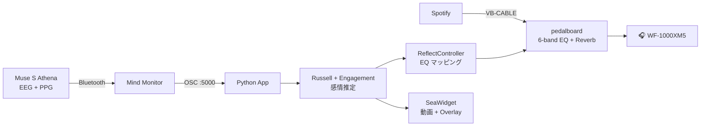

<div align="center">

# 🧠🎵 muse-emotion-eq

### **Your brain controls your music. In real time.**

EEG・心拍から感情を推定し、音楽の EQ と没入型映像をリアルタイム制御するデスクトップアプリ

[](.)
[](.)
[](.)
[](.)
[](LICENSE)
[](docs/ai_assisted_dev.md)


[**🚀 Quick Start**](#-quick-start) · [**🎬 Demo**](#-demo) · [**🏗 Architecture**](#-architecture) · [**📊 Accuracy Notes**](docs/muse_accuracy_notes.md) · [**🤖 AI Workflow**](docs/ai_assisted_dev.md)

</div>

---

## ✨ Why this project

> **「感情で音楽が変わる体験」を、自分の脳波と心拍で作る**

Sony が掲げる Vital Sensing × Affective Computing × Audio の交差点を、**MVP として 2 週間で動かしました**。Muse S Athena 1 台で取れる EEG / PPG から感情を推定し、それを **音 (EQ)** と **映像 (Sea ビュー)** の両方に同時反映させます。

---

## 🎬 Demo

| Studio (分析) | Listen (操作) | Watch (没入) |
|:---:|:---:|:---:|
|  |  |  |
| Raw EEG・スペクトログラム・Russell モデル | リボン感情バー + 楽器サークル | 神経網オーブ + 海背景 |

> ※ スクショは追加予定. 1 分デモ動画: [demo/demo_1min.mp4](demo/demo_1min.mp4)

---

## ⚡ Features

| | |
|---|---|
| 🧠 **EEG → EQ Auto** | Arousal / Valence / Engagement に応じて 6 バンド (Drums / Bass / Mid / Vocals / High / Air) のゲインを自動追従 |
| 🌊 **Emotional Seascape** | Calm / Golden / Storm の 3 シーン動画が感情でクロスフェード切替。HR で海面が脈動 |
| 🎚 **Manual / Auto モード** | 手動フェーダ操作と EEG 自動制御を切替 |
| 🎨 **Customizable Theme** | アクセント 15 色 × 背景 6 パレット = **90 通り** |
| 📡 **Mind Monitor OSC** | Muse S を Bluetooth 経由でスマホ → PC へ無線伝送 |
| 🤖 **AI 共同開発** | Claude (Anthropic) と 2 週間で MVP |

---

## 🚀 Quick Start

```powershell
# 1. Clone
git clone https://github.com/HIMEJI-HIRO/muse-emotion-eq.git
cd muse-emotion-eq

# 2. Install deps
pip install -r requirements.txt

# 3. Launch
python realtime_monitor.py
```

**前提**:
- Windows 10/11 + Python 3.11 (anaconda3 推奨)
- Muse S Athena + Mind Monitor (iOS/Android)
- VB-CABLE Virtual Audio Device

詳細セットアップ手順は [📖 docs/setup_windows.md](docs/setup_windows.md) を参照.

---

## 🏗 Architecture



詳細: [docs/architecture.md](docs/architecture.md)

---

## 🧪 Signal Processing

| 指標 | 計算 | 用途 |
|---|---|---|
| **Arousal** | β + γ 高域パワー | EQ Drums / High / Vocals |
| **Valence** | 前頭 α 左右差 (AF7/AF8) | EQ Air / Reverb / シーン選択 |
| **Engagement** | β / α 比 | EQ Mid / Vocals |
| **HR (BPM)** | PPG ピーク検出 (0.7–3 Hz BP) | 海面の脈動リング |
| **HSI** | Muse horseshoe (1 Good — 4 Bad) | 映像の霧エフェクト |

詳細: [docs/signal_processing.md](docs/signal_processing.md)

---

## 📊 Honest Accuracy Review

ポートフォリオには **「できること」と同じくらい「できないこと」** を書きました。

| 信号 | 信頼度 |
|---|:---:|
| **HR (BPM, PPG)** | ★★★★★ |
| **β/α 比 (Engagement)** | ★★★ |
| **Arousal** | ★★☆ |
| **Valence (前頭 α 左右差)** | ★☆ |

→ Valence は弱いため UI 側で **slow EMA + ヒステリシス + 最小滞留時間** を入れて誤認による画面バタつきを抑制。
詳細: [docs/muse_accuracy_notes.md](docs/muse_accuracy_notes.md)

---

## 🛠 Tech Stack

| Layer | Library |
|---|---|
| GUI | PyQt5, pyqtgraph |
| 信号処理 | NumPy, SciPy (Butterworth, Welch) |
| 音声 DSP | [pedalboard](https://github.com/spotify/pedalboard) (Spotify R&D), sounddevice |
| 動画背景 | OpenCV |
| OSC | python-osc |
| EEG | Muse S Athena + Mind Monitor |

---

## 📁 Repository Structure

```
muse-emotion-eq/
├── realtime_monitor.py      # メインエントリ (PyQt5 GUI + OSC)
├── audio_engine.py          # VB-CABLE → pedalboard → 出力
├── eq_controllers.py        # 感情 → EQ マッピング
├── eq_widgets.py            # 6-band 楽器フェーダ
├── sea_widget.py            # Emotional Seascape (動画 + overlay)
├── theme.py                 # 2軸テーマ (Accent × BG)
├── assets/sea/              # シーン動画 (Git LFS)
├── docs/                    # 設計ドキュメント
├── demo/                    # デモ動画・スクショ
└── scripts/                 # 環境チェック・診断ツール
```

---

## 🗺 Roadmap

- [x] **Phase 0** — Muse 受信 / 可視化基盤
- [x] **Phase 1** — 6-band EQ + 感情自動制御
- [x] **Phase 1.5** — Emotional Seascape (Calm / Golden / Storm)
- [x] **Phase 2 — UI 大改修** — Studio / Listen / Watch 3 モード, パーティクル EEG, 神経網オーブ, リボン感情バー
- [ ] **Phase 3** — Underwater シーン追加 (HR 駆動の海中映像 3 段階)
- [ ] **Phase 4** — CSV セッションリプレイ機能
- [ ] **Phase 5** — 個人 EEG キャリブレーション (ML)

---

## 🤖 AI Workflow

このプロジェクトは **人間が意思決定 → Claude (Anthropic) が実装** の分業で開発しました。
工程の正直な記録: [docs/ai_assisted_dev.md](docs/ai_assisted_dev.md)

---

## 📝 Design Decisions

実装中に下した主要な意思決定の理由をまとめました:
- なぜ 6-band フェーダから Sea ビューへ重心を移したか
- なぜ Storm を Underwater に置換予定か
- なぜ QMediaPlayer ではなく OpenCV を選んだか
- なぜ Watch HUD に 8 角プリズムを使ったか

詳細: [docs/design_decisions.md](docs/design_decisions.md)

---

## 📜 License

[MIT](LICENSE) — 自由に fork / 改変 / 商用利用可

---

<div align="center">

### Built by [@HIMEJI-HIRO](https://github.com/HIMEJI-HIRO)

For **Sony B64** (Vital Sensing / Affective Computing) Portfolio
🧠 + 🎵 + 🤖

</div>
