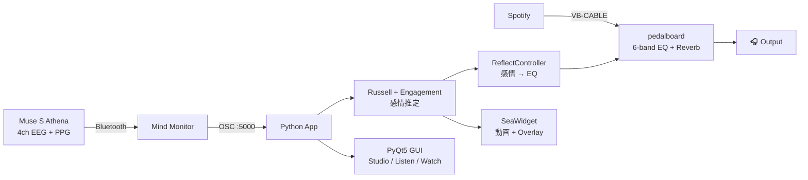

<div align="center">

# 🧠🎵 muse-emotion-eq

### **Your brain controls your music. In real time.**

Muse S Athena の EEG / PPG から感情を推定し、
**音楽の EQ と没入型映像**をリアルタイムで動かすデスクトップアプリ

<br>

[](.)
[](.)
[](.)
[](.)
[](LICENSE)

<br>


<br>

[**🚀 Quick Start**](#-quick-start) ·
[**🎬 Demo**](#-demo) ·
[**🏗 Architecture**](#-architecture) ·
[**🧪 Signal Processing**](docs/signal_processing.md) ·
[**📊 Accuracy Notes**](docs/muse_accuracy_notes.md) ·
[**🤖 AI Workflow**](docs/ai_assisted_dev.md)

</div>

---

## ✨ What is this?

**1 行で**: 脳波で音が変わるアプリ。

**3 行で**:
- Muse S Athena の **4ch EEG + PPG** から感情 (Arousal / Valence / Engagement / HR) を推定
- 推定値を**音楽 EQ** (Drums / Bass / Mid / Vocals / High / Air) と**没入型映像** (海 / 水中 / 都市 / 森) に同時反映
- **AI と二人三脚 (Claude / Veo / Imagen) で 2 週間で MVP**

> Vital Sensing × Affective Computing × Audio × Generative AI が一つに統合された MVP

---

## 🎬 Demo

### Three Modes

<table>
<tr>
<td align="center" width="33%">
<br>
<b>🧠 Studio</b><br>
<sub>分析: パーティクル EEG / Band Ring / Russell Pad / Adaptive EQ</sub>
</td>
<td align="center" width="33%">
<br>
<b>🎚 Listen</b><br>
<sub>操作: リボン感情バー / 楽器サークル / Big "Happy"</sub>
</td>
<td align="center" width="33%">
<br>
<b>🌊 Watch</b><br>
<sub>没入: 神経網オーブ / Matrix rain / Tron grid / 海映像</sub>
</td>
</tr>
</table>

### Watch — 4 Subviews driven by biosignals

<table>
<tr>
<td align="center" width="25%">
<br>
<b>🌅 Surface</b><br>
<sub>Arousal → 海面の morph 速度</sub>
</td>
<td align="center" width="25%">
<br>
<b>🐳 Underwater</b><br>
<sub>HR で 3 段階: 空海 / 魚群 / ジンベエ+マンタ</sub>
</td>
<td align="center" width="25%">
<br>
<b>🌆 City</b><br>
<sub>HR で色温度・脈動 vignette</sub>
</td>
<td align="center" width="25%">
<br>
<b>🌲 Forest</b><br>
<sub>Engagement で速度 / Valence で tint</sub>
</td>
</tr>
</table>

---

## ⚡ Features

<table>
<tr>
<td valign="top" width="50%">

### 🎛 Audio Engine
- **EEG → EQ Auto**: Arousal / Valence / Engagement で 6 バンド + Reverb を自動追従
- VB-CABLE → pedalboard → 任意出力デバイス
- Manual / Auto モード即切替
- マスター音量スライダ + リアルタイム VU メータ
- 録画 (CSV) + リプレイ ▶

</td>
<td valign="top" width="50%">

### 🎨 UI / UX
- **3 モード** (Studio / Listen / Watch) + スライドアニメ
- **2軸テーマ**: Accent 15 色 × BG 6 = 90 パターン + 🎨 カスタム色ピッカー
- カードドラッグ並び替え + hover 詳細パネル
- ⌨ ショートカット文脈別: `1/2/3/4` `Space` `R` `F1/F11/F12`
- 起動スプラッシュ / Welcome / About / Settings
- Toast 通知 / Idle スクリーンセーバー

</td>
</tr>
<tr>
<td valign="top" width="50%">

### 🌟 Visual Polish
- パーティクル EEG (4ch × 60 粒子)
- 神経網オーブ (Fibonacci 球面 + magenta/cyan spiral)
- Matrix rain + Tron wireframe grid
- 六角形 EQ ラベル + δθαβγ 弧
- リボン感情バー (流体ベジエ)
- 楽器サークル (テクスチャ画像 + ネオン縁)
- HUD: NEURAL STATE + EQ STATE + [STATUS] バー
- Watch 📷 Photo / マウス追従パーティクル

</td>
<td valign="top" width="50%">

### 📡 Hardware / Integration
- **Muse S Athena** (EEG 4ch + PPG + 光学) → Mind Monitor → PC OSC
- Bluetooth レイテンシ対応 (1024 buffer, "high" latency)
- 出力デバイス Host API 自動マッチング (Illegal combination 回避)
- ヘッダの背景は AI 生成回路パターン (Imagen)
- 没入映像は AI 生成 (Veo) — 海 / 水中 / 都市 / 森

</td>
</tr>
</table>

---

## 🚀 Quick Start

```powershell
# 1. Clone
git clone https://github.com/HIMEJI-HIRO/muse-emotion-eq.git
cd muse-emotion-eq

# 2. Install
pip install -r requirements.txt

# 3. Launch
python realtime_monitor.py
```

**前提**:
- Windows 10/11 + Python 3.11 (anaconda3 推奨)
- Muse S Athena + Mind Monitor (iOS/Android, ~1,500 円)
- VB-CABLE Virtual Audio Device (無料)

詳細セットアップ: [📖 docs/setup_windows.md](docs/setup_windows.md)

---

## ⌨ Keyboard Shortcuts

| キー | 動作 |
|:---:|---|
| `1` `2` `3` | Studio / Listen / Watch (文脈別: Watch 内では sub-view 切替) |
| `4` | Watch 内で 🌲 Forest サブビュー |
| `Space` | ♪ Audio ON / OFF |
| `R` | ● REC トグル |
| `F1` | キーボードショートカット一覧 |
| `F11` | ⛶ 全画面トグル |
| `F12` | 📷 スクリーンショット保存 |

---

## 🏗 Architecture



詳細: [docs/architecture.md](docs/architecture.md)

---

## 🧪 Signal Processing

| 指標 | 計算 | 用途 |
|---|---|---|
| **Arousal** | β + γ 高域パワー | EQ Drums / High / Vocals + 海面速度 |
| **Valence** | 前頭 α 左右差 (AF7/AF8) | EQ Air / Reverb / シーン選択 |
| **Engagement** | β / α 比 | EQ Mid / Vocals + 森シーン速度 |
| **HR (BPM)** | PPG ピーク検出 + OSC | 海面リング / 水中シーン切替 / 都市 vignette |
| **HSI** | Muse horseshoe (1=Good, 4=Bad) | 映像の霧エフェクト |

詳細: [docs/signal_processing.md](docs/signal_processing.md)

---

## 📊 Honest Accuracy Review

> ポートフォリオに**「できないこと」も正直に書く**

| 信号 | 信頼度 | コメント |
|---|:---:|---|
| **HR (BPM, PPG)** | ★★★★★ | ±2 BPM、これが体験の主軸 |
| **β/α 比 (Engagement)** | ★★★ | 比なので接触ムラに比較的強い |
| **Arousal** | ★★☆ | 噛み締め・瞬きに弱い |
| **Valence (前頭 α 左右差)** | ★☆ | **再現性低**。UI 側で hysteresis + slow EMA で吸収 |

詳細: [docs/muse_accuracy_notes.md](docs/muse_accuracy_notes.md)

---

## 🛠 Tech Stack

| Layer | Library / Asset |
|---|---|
| GUI | PyQt5, pyqtgraph |
| 信号処理 | NumPy, SciPy (Butterworth, Welch) |
| 音声 DSP | [pedalboard](https://github.com/spotify/pedalboard) (Spotify R&D), sounddevice |
| 動画背景 | OpenCV (cv2) |
| OSC | python-osc |
| EEG | Muse S Athena + Mind Monitor |
| AI 生成 | Veo (動画 7本) / Imagen (画像 9枚) |
| 共同開発 | **Claude (Anthropic)** |

---

## 📁 Repository Structure

```
muse-emotion-eq/
├── realtime_monitor.py      # メインエントリ (PyQt5 GUI + OSC)
├── audio_engine.py          # VB-CABLE → pedalboard → 出力
├── eq_controllers.py        # 感情 → EQ マッピング
├── eq_widgets.py            # 6-band 楽器フェーダ
├── sea_widget.py            # Emotional Seascape (動画 + overlay)
├── theme.py                 # 2 軸テーマ (Accent × BG)
│
├── assets/
│   ├── sea/                 # AI 生成シーン動画 7 本 (Git LFS)
│   ├── bg/                  # ヘッダ背景 / City 背景
│   └── instruments/         # 楽器テクスチャ 6 枚
├── docs/                    # 設計ドキュメント + UI スクショ
├── demo/                    # デモ動画 (Git LFS)
└── scripts/                 # 環境チェック / 自動スクショ
```

---

## 🗺 Roadmap

- [x] **Phase 0** — Muse 受信 / 可視化基盤
- [x] **Phase 1** — 6-band EQ + 感情自動制御
- [x] **Phase 1.5** — Emotional Seascape (Calm / Golden / Storm)
- [x] **Phase 2** — UI 大改修 (Studio / Listen / Watch 3 モード)
- [x] **Phase 3** — Underwater シーン (HR 駆動 3 段階)
- [x] **Phase 3.5** — City + Forest サブビュー (動画 + HR シンク)
- [x] **Phase 4** — CSV セッションリプレイ機能
- [x] **Phase 5** — UX 微調整層 (toast, shortcut, settings 等 15+)
- [ ] **Phase 6** — 個人 EEG キャリブレーション (ML)
- [ ] **Phase 7** — 1 分デモ動画 + Public 化

---

## 🤖 AI Workflow

このプロジェクトは **Claude (Anthropic)** との対話駆動で開発した。
人間が**意思決定** / AI が**実装** の明確な分業。
工程記録: [docs/ai_assisted_dev.md](docs/ai_assisted_dev.md)

**生成 AI 利用箇所**:
- 📝 Code: Claude — Python ~5,500 行
- 🎬 Videos: Veo 3 — 海 calm/golden/storm/morph、水中 low/mid/high、都市、森
- 🖼 Images: Imagen — 回路パターン、サイバー都市、楽器テクスチャ 6 枚

---

## 📜 License

[MIT](LICENSE) — 自由に fork / 改変 / 商用利用可

---

<div align="center">

### Built by [@HIMEJI-HIRO](https://github.com/HIMEJI-HIRO)

**Portfolio project — Vital Sensing × Affective Computing × Audio × AI**

⭐ Star this repo if you find it interesting!

</div>
