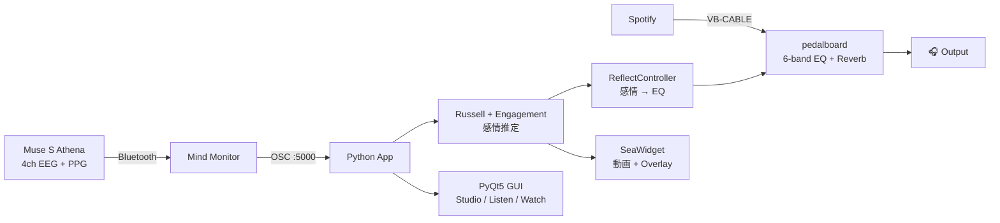

<div align="center">

# 🧠🎵 muse-emotion-eq

### **Your brain controls your music. In real time.**

Muse S Athena の EEG / PPG から感情を推定し、
**音楽の EQ と没入型映像**をリアルタイムで動かすデスクトップアプリ

<br>

[](.)
[](.)
[](.)
[](.)
[](LICENSE)

<br>


<br>

[**🚀 Quick Start**](#-quick-start) ·
[**🎬 Demo**](#-demo) ·
[**🏗 Architecture**](#-architecture) ·
[**🧪 Signal Processing**](docs/signal_processing.md) ·
[**📊 Accuracy Notes**](docs/muse_accuracy_notes.md) ·
[**🤖 AI Workflow**](docs/ai_assisted_dev.md)

</div>

---

## ✨ What is this?

**1 行で**: 脳波で音が変わるアプリ。

**3 行で**:
- Muse S Athena の **4ch EEG + PPG** から感情 (Arousal / Valence / Engagement / HR) をリアルタイム推定
- 推定値を**音楽 EQ** (Drums / Bass / Mid / Vocals / High / Air) と**没入型映像** (海 / 水中) に同時反映
- 設計・実装は **Claude (Anthropic) Code SDK** との対話駆動で進めた

> Vital Sensing × Affective Computing × Audio × Generative AI を一つに統合した個人プロジェクト

### なぜ作ったか

音楽を聴いている時の **生体反応** がそのまま音と映像に返ってくる体験を作りたかった。
スマートウォッチが心拍を見せて終わるのではなく、**心拍が上がる → 海が深く潜って
ジンベエザメが現れる** ような **環境の応答** にすることで、人と機械の境目を柔らかくする
インタラクションを試した。デモは **ヘッドセット無しでも `▶ Demo` モードで体験可能**。

### 30 秒で分かるポイント

| | |
|---|---|
| 🧠 **入力** | Muse S Athena (4ch EEG + PPG) → Mind Monitor → OSC :5000 |
| 📊 **感情推定** | Russell 円環モデル (Arousal / Valence) + Engagement (β/α 比) を 30 Hz で算出 |
| 🎵 **音への反映** | `pedalboard` で 6 バンド EQ + Reverb をリアルタイム制御 (VB-CABLE 経由) |
| 🌊 **映像への反映** | 海面 morph (EEG 駆動) / 水中 2 ゾーン (HR 駆動) |
| 🤖 **AI 協働** | Claude Code SDK と対話駆動で実装 · Veo / Imagen でビジュアル素材生成 |
| 📦 **動作確認** | ヘッドセット無しでも `▶ Demo` モードで全シーンを 60 秒ループ体験 |

---

## 🎬 Demo

### Three Modes

<table>
<tr>
<td valign="top" width="33%">
<br>
<b>🧠 Studio  ·  分析モード</b>
<p align="left">
<sub>
4ch の <b>生 EEG 波形</b>、<b>スペクトログラム</b>、<b>バンドパワー</b> (δθαβγ)、
<b>信号品質</b>、<b>Russell 感情座標</b>、<b>HR / fNIRS 波形</b> を 1 画面に並べ、
脳波がどう感情と音に変換されているかを<b>同時に観察</b>できる開発・分析向けレイアウト.
6 バンドフェーダで <b>Auto ↔ Manual</b> 切替、カードはドラッグで並び替え可能.
</sub>
</p>
</td>
<td valign="top" width="33%">
<br>
<b>🎚 Listen  ·  操作モード</b>
<p align="left">
<sub>
画面中央に大きな <b>感情ラベル</b> と <b>BRAIN POWER 流れる波形</b>、その下に
<b>HEART RATE</b> (♥ XX BPM + PPG ミニ波形)、最下段に <b>6 つの楽器サークル</b>.
サークルを<b>クリック</b>: 上半分で <b>+0.5dB</b> / 下半分で <b>-0.5dB</b>.
6 種類の<b>プリセット</b> (Vocal / Drums / Spatial 等) と Reverb スライダで瞬時に音作り.
</sub>
</p>
</td>
<td valign="top" width="33%">
<br>
<b>🌊 Watch  ·  没入モード</b>
<p align="left">
<sub>
操作 UI を排して<b>映像と音だけ</b>に集中. <b>🌊 Surface</b> (脳波駆動の海面 morph)
と <b>🌊 Underwater</b> (心拍駆動の 🐠 サンゴ礁 ↔ 🐋 ジンベエ) の 2 サブビュー.
中央に <b>神経網オーブ</b>、背景に Matrix rain + Tron grid、画面右上の
<b>Driver Badge</b> が「今この映像は何で動いているか」を常時表示.
<b>▶ Demo ボタン</b>でヘッドセット無しでも 60 秒の循環体験.
</sub>
</p>
</td>
</tr>
</table>

### Watch — 2 Subviews with explicit drivers

<table>
<tr>
<td align="center" width="50%">
<br>
<b>🌊 Surface  ·  🧠 EEG-driven</b><br>
<sub>Arousal × Valence × Engagement で海面の表情と morph 速度が変化.<br>
画面右上に常時 <code>🧠 EEG-DRIVEN  ·  Arousal 0.72  ·  Valence 0.32</code> オーバーレイ.</sub>
</td>
<td align="center" width="50%">
<br>
<b>🌊 Underwater  ·  ♥ HR-driven</b><br>
<sub>HR 閾値 82 BPM のヒステリシスで <b>🐠 サンゴ礁</b> ↔ <b>🐋 ジンベエザメ</b> の 2 シーンをクロスフェード.<br>
画面右上に <code>♥ HR-DRIVEN  ·  92 BPM  ·  zone: HIGH 🐋</code> オーバーレイ.</sub>
</td>
</tr>
</table>

### Underwater — 2 Zones with hysteresis

<table>
<tr>
<td align="center" width="50%">
<br>
<b>🐠 LOW zone  ·  &lt; 82 BPM</b><br>
<sub>サンゴ礁を魚たちが泳ぐ平常状態. 安静ベースライン.</sub>
</td>
<td align="center" width="50%">
<br>
<b>🐋 HIGH zone  ·  ≥ 82 BPM</b><br>
<sub>ジンベエザメが画面を泳ぐ. 興奮 / 軽い身体活動状態.</sub>
</td>
</tr>
</table>

### ▶ Demo Mode (no headset required)


Watch 右上の **`▶ Demo`** ボタンで起動. 60 秒ループで EEG/HR を**滑らかに連続変化**させて、
ヘッドセットを持っていない人にも「どの数値がどの画面要素を動かすか」を体験させられる:

```
0s ────────── 30s ────────── 60s
🧠 Surface (EEG)                    ♥ Underwater (HR)
CALM → RISING → INTENSE → STORMY    🐠 サンゴ礁 → 🐋 ジンベエ → 🐠 サンゴ礁
A: 0.30 → 0.72                      BPM: 65 → 96 → 65
V: 0.62 → 0.32                      zone: LOW 12.7s / HIGH 17.3s
E: 0.42 → 0.62
```

**右側の説明パネル** がリアルタイムでメータを動かし、現在の phase / 駆動源 / "何が起きているか" を
日本語で解説. デモ動画録画にもそのまま使えるよう設計:

| 要素 | 中身 |
|---|---|
| ヘッダー | `▶ DEMO MODE` + 経過秒数 |
| Phase ピル | `PHASE · STORMY` (色: EEG 紫 / HR 赤) |
| 進捗バー | 60 秒サイクル内の現在位置 |
| EEG セクション | Arousal / Valence / Engagement の横バー + 数値 |
| HR セクション | BPM 横バー + Zone (🐠 LOW / 🐋 HIGH) |
| What's happening | phase 別の日本語ナレーション |
| Timeline | 5 phase インジケータ (現在地ハイライト) |

---

## ⚡ Features

<table>
<tr>
<td valign="top" width="50%">

### 🎛 Audio Engine
- **EEG → EQ Auto**: Arousal / Valence / Engagement で 6 バンド + Reverb を自動追従
- VB-CABLE → pedalboard → 任意出力デバイス
- Manual / Auto モード即切替
- マスター音量スライダ + リアルタイム VU メータ
- 録画 (CSV) + リプレイ ▶

</td>
<td valign="top" width="50%">

### 🎨 UI / UX
- **3 モード** (Studio / Listen / Watch) + スライドアニメ
- **2軸テーマ**: Accent 15 色 × BG 6 = 90 パターン + 🎨 カスタム色ピッカー
- カードドラッグ並び替え + hover 詳細パネル
- ⌨ 文脈別ショートカット: `1/2/3` `Ctrl+1/2/3` `Space` `R` `F1/F11/F12`
- 起動スプラッシュ / Welcome / About / Settings
- Toast 通知 / Idle スクリーンセーバー

</td>
</tr>
<tr>
<td valign="top" width="50%">

### 🌟 Visual Polish
- パーティクル EEG (4ch × 60 粒子)
- 神経網オーブ (Fibonacci 球面 + magenta/cyan spiral)
- Matrix rain + Tron wireframe grid
- 六角形 EQ ラベル + δθαβγ 弧 (Surface のみ)
- リボン感情バー (流体ベジエ)
- 楽器サークル (テクスチャ画像 + ネオン縁)
- HUD: NEURAL STATE + EQ STATE + 駆動源バッジ
- Watch 📷 Photo / マウス追従パーティクル / ▶ Demo モード

</td>
<td valign="top" width="50%">

### 📡 Hardware / Integration
- **Muse S Athena** (EEG 4ch + PPG + 光学) → Mind Monitor → PC OSC
- Bluetooth レイテンシ対応 (1024 buffer, "high" latency)
- 出力デバイス Host API 自動マッチング (Illegal combination 回避)
- ヘッダ背景 + 楽器テクスチャは AI 生成 (Imagen)
- 没入映像は AI 生成 (Veo) — 海面 morph / 水中 LOW (サンゴ礁) / HIGH (ジンベエザメ)

</td>
</tr>
</table>

---

## 🚀 Quick Start

```powershell
# 1. Clone
git clone https://github.com/HIMEJI-HIRO/muse-emotion-eq.git
cd muse-emotion-eq

# 2. Install
pip install -r requirements.txt

# 3. Launch
python realtime_monitor.py
```

**前提**:
- Windows 10/11 + Python 3.11 (anaconda3 推奨)
- Muse S Athena + Mind Monitor (iOS/Android, ~1,500 円)
- VB-CABLE Virtual Audio Device (無料)

詳細セットアップ: [📖 docs/setup_windows.md](docs/setup_windows.md)

---

## ⌨ Keyboard Shortcuts

| キー | 動作 |
|:---:|---|
| `1` `2` `3` | Studio / Listen / Watch モード切替 |
| `1` `2` (Watch 内) | 🌊 Surface (🧠 EEG) / 🌊 Underwater (♥ HR) サブビュー |
| `Ctrl+1/2/3` | モード切替 (どこからでも) |
| `Space` | ♪ Audio ON / OFF |
| `R` | ● REC トグル |
| `F1` | キーボードショートカット一覧 |
| `F11` | ⛶ 全画面トグル |
| `F12` | 📷 スクリーンショット保存 |

---

## 🏗 Architecture



詳細: [docs/architecture.md](docs/architecture.md)

---

## 🧪 Signal Processing

| 指標 | 計算 | 用途 |
|---|---|---|
| **Arousal** | β + γ 高域パワー | EQ Drums / High / Vocals + 海面速度 |
| **Valence** | 前頭 α 左右差 (AF7/AF8) | EQ Air / Reverb / シーン選択 |
| **Engagement** | β / α 比 | EQ Mid / Vocals + 森シーン速度 |
| **HR (BPM)** | PPG ピーク検出 + OSC | 海面リング / Underwater シーン切替 (LOW ↔ HIGH) |
| **HSI** | Muse horseshoe (1=Good, 4=Bad) | 映像の霧エフェクト |

詳細: [docs/signal_processing.md](docs/signal_processing.md)

---

## 📊 Honest Accuracy Review

> ポートフォリオに**「できないこと」も正直に書く**

| 信号 | 信頼度 | コメント |
|---|:---:|---|
| **HR (BPM, PPG)** | ★★★★★ | ±2 BPM、これが体験の主軸 |
| **β/α 比 (Engagement)** | ★★★ | 比なので接触ムラに比較的強い |
| **Arousal** | ★★☆ | 噛み締め・瞬きに弱い |
| **Valence (前頭 α 左右差)** | ★☆ | **再現性低**。UI 側で hysteresis + slow EMA で吸収 |

詳細: [docs/muse_accuracy_notes.md](docs/muse_accuracy_notes.md)

---

## 🛠 Tech Stack

| Layer | Library / Asset |
|---|---|
| GUI | PyQt5, pyqtgraph |
| 信号処理 | NumPy, SciPy (Butterworth, Welch) |
| 音声 DSP | [pedalboard](https://github.com/spotify/pedalboard) (Spotify R&D), sounddevice |
| 動画背景 | OpenCV (cv2) |
| OSC | python-osc |
| EEG | Muse S Athena + Mind Monitor |
| AI 生成 | Veo (海 + 水中シーン) / Imagen (回路パターン、楽器テクスチャ) |
| 共同開発 | **Claude (Anthropic) Code SDK** |

---

## 📁 Repository Structure

```
muse-emotion-eq/
├── realtime_monitor.py      # メインエントリ (PyQt5 GUI + OSC)
├── audio_engine.py          # VB-CABLE → pedalboard → 出力
├── eq_controllers.py        # 感情 → EQ マッピング
├── eq_widgets.py            # 6-band 楽器フェーダ
├── sea_widget.py            # Emotional Seascape (動画 + overlay)
├── theme.py                 # 2 軸テーマ (Accent × BG)
│
├── assets/
│   ├── sea/                 # AI 生成シーン動画 (Git LFS)
│   ├── bg/                  # ヘッダ背景パターン
│   └── instruments/         # 楽器テクスチャ 6 枚
├── docs/                    # 設計ドキュメント + UI スクショ
├── demo/                    # デモ動画 / プロモ素材 (Git LFS)
├── scripts/                 # 環境チェック / 自動スクショ / 録画
├── CHANGELOG.md             # バージョン履歴
└── CONTRIBUTING.md          # 開発参加ガイド
```

---

## 🗺 Roadmap

- [x] **Phase 0** — Muse 受信 / 可視化基盤
- [x] **Phase 1** — 6-band EQ + 感情自動制御
- [x] **Phase 1.5** — Emotional Seascape (Calm / Golden / Storm)
- [x] **Phase 2** — UI 大改修 (Studio / Listen / Watch 3 モード)
- [x] **Phase 3** — Underwater 2-zone (🐠 サンゴ礁 / 🐋 ジンベエ) HR 駆動
- [x] **Phase 4** — CSV セッションリプレイ機能
- [x] **Phase 5** — UX 微調整層 (toast, shortcut, settings 等 15+)
- [x] **Phase 6** — Driver-source overlay + Demo モード (ヘッドセット無しレビュー対応)
- [x] **Phase 7** — Public 化 + ポートフォリオ整備
- [ ] **Phase 8** — 個人 EEG キャリブレーション (ML)
- [ ] **Phase 9** — 1 分デモ動画録画 + LabBase/TechOffer 連携

---

## 🤖 AI Workflow

このプロジェクトは **Claude (Anthropic) Code SDK** との対話駆動で開発した。
人間が**意思決定**、AI が**実装** という明確な分業。
工程記録: [docs/ai_assisted_dev.md](docs/ai_assisted_dev.md)

**生成 AI 利用箇所**:
- 📝 Code: Claude — Python ~6,000 行 + ドキュメント
- 🎬 Videos: Veo — 海面 morph 動画、水中サンゴ礁、水中ジンベエザメ
- 🖼 Images: Imagen — ヘッダ回路パターン、楽器テクスチャ 6 枚

---

## 📜 License

[MIT](LICENSE) — 自由に fork / 改変 / 商用利用可

---

<div align="center">

### Built by [@HIMEJI-HIRO](https://github.com/HIMEJI-HIRO)

**Portfolio project — Vital Sensing × Affective Computing × Audio × AI**

⭐ Star this repo if you find it interesting!

</div>
