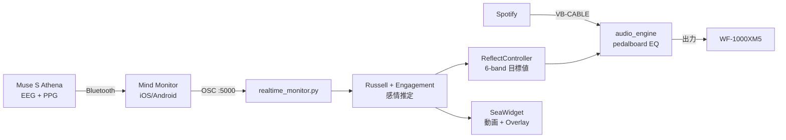

# 🧠🎵 muse-emotion-eq

> **Muse S Athena の EEG / PPG から感情を推定し、音楽の EQ と海の映像をリアルタイムで制御するシステム**


---

## ✨ 特徴

- **🧠 EEG 駆動の 6-band EQ** — Arousal / Valence / Engagement に応じて Drums / Bass / Mid / Vocals / High / Air のゲインを自動追従
- **🌊 Emotional Seascape** — 感情で Calm / Golden / Underwater の海映像が cross-fade。HR で海面が脈動
- **🎚 Manual / Auto モード** — 手動フェーダ操作と EEG 自動制御を切替
- **🎨 2軸テーマ** — Accent 15色 × BG 6パレット = 90通り
- **📡 Mind Monitor OSC** — Muse S を Bluetooth → スマホ → PC へ無線伝送
- **🤖 AI 共同開発** — Claude (Anthropic) と二人三脚で 2 週間で MVP

---

## 🎬 デモ


> *デモ動画は [demo/demo_1min.mp4](demo/demo_1min.mp4) を参照*

---

## 🏗 アーキテクチャ



---

## 🚀 1 分で起動 (Windows)

### 前提
- Windows 10/11
- Python 3.11 (anaconda3 推奨)
- Muse S Athena (Mind Monitor アプリ入り iPhone/Android)
- VB-CABLE Virtual Audio Device

### セットアップ

```powershell
# 1. リポジトリ取得
git clone https://github.com/HIROHISA-S/muse-emotion-eq.git
cd muse-emotion-eq

# 2. 依存インストール
pip install -r requirements.txt
```

### 起動手順

1. **VB-CABLE** インストール → Spotify の出力先を `CABLE Input` に変更
2. **Muse S** を Bluetooth で iPhone/Android に接続 → **Mind Monitor** で OSC 送信先を `<PC_IP>:5000` に設定
3. アプリ起動:
   ```powershell
   python realtime_monitor.py
   ```
4. ヘッダの **`🎵 Audio ON`** を押して、出力デバイスに `WF-1000XM5` (または好きなヘッドホン) を選択
5. Spotify で再生開始 → EEG で EQ が動き始める

詳細: [docs/setup_windows.md](docs/setup_windows.md)

---

## 🧪 信号処理

| 指標 | 計算 | 用途 |
|---|---|---|
| **Arousal** | β + γ 高域パワー | EQ Drums / High / Vocals |
| **Valence** | 前頭 α 左右差 (AF7/AF8) | EQ Air / Reverb / シーン選択 |
| **Engagement** | β / α 比 | EQ Mid / Vocals |
| **HR (BPM)** | PPG ピーク検出 (0.7–3 Hz BP) | 海面の脈動リング |
| **HSI** | Muse horseshoe (1=Good, 4=Bad) | 映像の霧エフェクト |

詳細: [docs/signal_processing.md](docs/signal_processing.md)

---

## 📊 Muse S Athena の精度について

正直な評価を [docs/muse_accuracy_notes.md](docs/muse_accuracy_notes.md) にまとめている。要点:

- **HR は ★★★★★** (PPG 信頼性高)
- **Engagement (β/α) は ★★★** (比率なので接触ムラに強い)
- **Arousal は ★★☆** (噛み締め・まばたきに弱い)
- **Valence は ★☆** (前頭 α 左右差 2点だと再現性低)

この限界を踏まえ、UI 設計は **Valence にメインの重みを置かず、HR を主役にする** 方針を取った。

---

## 🛠 技術スタック

| カテゴリ | ライブラリ |
|---|---|
| GUI | PyQt5, pyqtgraph |
| 信号処理 | NumPy, SciPy (Butterworth, Welch) |
| 音声 DSP | pedalboard (Spotify R&D), sounddevice |
| 動画背景 | OpenCV (cv2.VideoCapture) |
| OSC 受信 | python-osc |
| EEG ヘッドセット | Muse S Athena + Mind Monitor |

---

## 📁 リポジトリ構成

```
muse-emotion-eq/
├── realtime_monitor.py       # メインエントリ (PyQt5 GUI + OSC 受信)
├── audio_engine.py           # VB-CABLE → pedalboard → 出力
├── eq_controllers.py         # 感情 → EQ マッピング (ReflectController)
├── eq_widgets.py             # 6-band 楽器フェーダ Widget
├── sea_widget.py             # Emotional Seascape (動画 + overlay)
├── theme.py                  # Accent × BG テーマ管理
│
├── assets/sea/               # シーン動画 (Git LFS)
├── docs/                     # 設計ドキュメント
├── demo/                     # デモ動画・スクショ
├── scripts/                  # 環境チェック・手動テスト
└── archive/                  # 過去の試行錯誤 (deprecated)
```

---

## 🎓 設計判断ログ

開発中に下した主な判断と理由:

- **6-band Mixer から Sea ビューへ重心移動** ([docs/design_decisions.md](docs/design_decisions.md))
- **Storm シーン → Underwater シーンに置換** (体験を優しく)
- **動画は QMediaPlayer ではなく OpenCV** (Windows DirectShow の H.264 失敗回避)
- **シーン切替に hysteresis + 6秒滞留** (EEG ノイズ対策)

---

## 🗺 ロードマップ

- [x] Phase 0: 可視化基盤 + Muse 受信
- [x] Phase 1: 6-band EQ + 感情自動制御
- [x] Phase 1.5: Emotional Seascape (Calm / Golden / Storm)
- [ ] Phase 2: Underwater シーン置換
- [ ] Phase 2: CSV セッションリプレイ機能
- [ ] Phase 3: 個人 EEG キャリブレーション (ML)

---

## 🤖 AI 共同開発について

このプロジェクトは **Claude (Anthropic)** との対話駆動で開発した。
人間が**仕様判断・UX 設計**を、AI が**実装**を担当する分業。
工程記録: [docs/ai_assisted_dev.md](docs/ai_assisted_dev.md)

---

## 📜 ライセンス

MIT License — [LICENSE](LICENSE) 参照

---

## 👤 作者

**HIROHISA-S** (Himeji Hiro)
Sony B64 (Vital Sensing / Affective Computing) 部門応募ポートフォリオ
