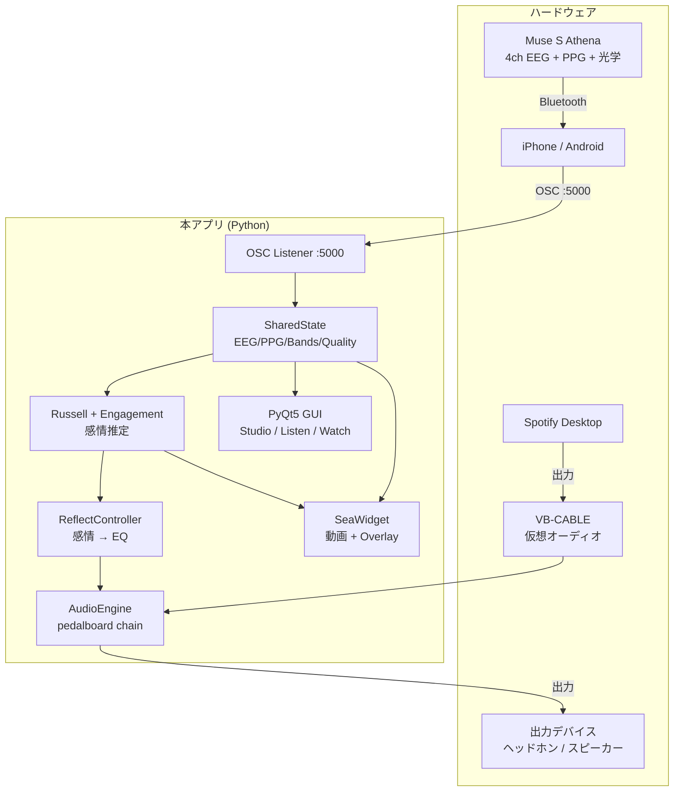

# Architecture

## システム全体図



## モジュール責務

### `realtime_monitor.py` (メインエントリ)
PyQt5 GUI のトップレベル。30 fps のメインループ + OSC ディスパッチ起動 + 録画機能 + 3 モード UI (Studio / Listen / Watch) を管理。

#### 主要クラス
| クラス | 役割 |
|---|---|
| `MainWindow` | 全体ウィンドウ. ヘッダ + Stack ページ (grid/listen/watch/focus) |
| `Card` | グリッド配置用カードフレーム (テーマ追従, accent border, hover popup) |
| `SplashScreen` | 起動時スプラッシュ (回路パターン + neon タイトル) |
| `_HoverInfoPopup` | カード hover で出るフローティング情報パネル |
| `_ParticleEEG` | パーティクル付き Raw EEG 波形 (4ch) |
| `_BandSphere` | ネオンリングゲージ (Band Power 用) |
| `_RussellPad` | Russell Circumplex 2D マップ (custom paint) |
| `_BrainWave` | Listen の流れる band power 波形 |
| `_InstrumentCircle` | Listen の楽器サークル (テクスチャ画像 + ネオン縁) |
| `_RibbonBar` | Listen の流体リボン感情バー (ベジエ) |
| `_HudBar` | グラデーション付きバー (Watch HUD など) |
| `_StatusMeter` | 段ブロックメータ (audio level / arousal) |
| `_MandalaOverlay` | Watch 中央の神経網オーブ + EQ 放射状ライン + 弧バンドラベル |
| `_MatrixRain` | Watch 背景の binary rain |
| `_TronGrid` | Watch 背景の wireframe perspective grid |
| `_HoverInfoPopup` | カード hover で表示するフローティングパネル |

### `audio_engine.py`
- VB-CABLE 入力 → pedalboard chain → 出力デバイス
- pedalboard chain: `LowShelf` + 4 × `PeakFilter` + `HighShelf` + `Reverb`
- デバイス自動検出 + 手動上書き
- スレッドセーフな gain 更新 (Lock)
- `get_output_level()`: UI のレベルメータ用 RMS 値

### `eq_controllers.py`
- `ReflectController`: 感情 (Arousal / Valence / Engagement) → 6-band 目標 dB マッピング
- EMA 平滑 (τ≈3s)
- audio へのプッシュをスロットル (10 Hz + 0.05 dB 変化しきい値)

### `eq_widgets.py`
- `InstrumentFader` — 縦フェーダ単体 (paintEvent カスタム, ネオングロー)
- `InstrumentFaderBank` — 6 fader を横並び
- signal: `band_changed(str, float)`

### `sea_widget.py`
- `SeaWidget` — 動画背景 + オーバーレイ + サブビュー切替
- `_VideoSource` — `cv2.VideoCapture` のラッパ
- **サブビュー**:
  - `surface` — `sea_surface_morph.mp4` (1本動画ループ, Arousal で速度可変)
  - `underwater` — 3 動画 (low/mid/high) HR ヒステリシス切替
  - `city` — `bg_city.png` 静止画 + HR シンク tint/pulse/zoom
- overlay: カラーティント / HR リング / グリッター / 泡 / 霧
- `set_sub_view(name)` API で外部から切替

### `theme.py`
- `ThemeManager`: Accent (15色) × Background (6パレット) の 2 軸
- 変更通知の pub-sub (`subscribe(callback)`)

## データフロー — 30 fps メインループ

```
update_ui() 開始
├ state.lock 取得
│  ├ EEG / PPG / band power / quality / HR をスナップショット
│  └ release
├ EEG プロット更新 (_ParticleEEG.set_data)
├ Spectrogram 更新 (1 Hz throttle)
├ Band Power Sphere 更新 (_BandSphere.set_value)
├ Quality dot 呼吸アニメ
│
├ 感情計算
│  ├ rus = compute_russell(bands, quality)
│  ├ eng = compute_engagement(bands, quality)
│  └ ar  = compute_arousal_only(bands, quality)
│
├ Russell view 更新 (_RussellPad.set_position + set_trail)
│
├ Listen UI 更新 (mode == "listen" 時)
│  ├ Emotion label/glow
│  ├ Ribbon bars (Arousal / Valence)
│  ├ Brain power waves
│  ├ Instrument circles
│  └ Reverb ribbon
│
├ Watch HUD 更新 (mode == "watch" 時)
│  ├ ARO/VAL/ENG グラデバー
│  ├ シーン badge + status dots + audio meter
│  ├ 品質ドット 4ch
│  ├ REC バッジ
│  └ HR 大型表示 + 心拍パルス
│
├ EQ Auto tick (Auto mode のみ)
│  └ ReflectController.tick(rus, eng)
│
├ Sea state 更新 (Sea 表示 or Watch mode)
│  └ sea_widget.set_state(arousal, valence, engagement, hr, hsi, fresh)
│
├ CSV 書き込み (録画中)
├ HR / Spectrogram の追加更新 (低頻度)
└ ヘッダ status / rate / audio level メータ更新
```

## スレッド構成

| スレッド | 役割 |
|---|---|
| Main (Qt) | GUI 描画, メインループ (33ms / 30 fps) |
| OSC Server | pythonosc ディスパッチャ |
| Audio Stream | sounddevice コールバック (高優先度) |
| Video Source | cv2 フレーム読み込み (メインスレッド内, scrub_read or update) |

`state` の読み書きは `threading.Lock` で保護。
audio の gain 更新は Lock + GIL で atomic。

## ファイル/アセット構造

```
muse-emotion-eq/
├── realtime_monitor.py      # メインエントリ
├── audio_engine.py          # VB-CABLE → pedalboard → 出力
├── eq_controllers.py        # 感情 → EQ マッピング
├── eq_widgets.py            # 6-band 楽器フェーダ
├── sea_widget.py            # Emotional Seascape (動画 + overlay)
├── theme.py                 # 2 軸テーマ (Accent × BG)
│
├── assets/
│   ├── sea/                 # 海面・水中動画 (Git LFS)
│   │   ├── sea_calm.mp4
│   │   ├── sea_golden.mp4
│   │   ├── sea_storm.mp4
│   │   ├── sea_surface_morph.mp4
│   │   ├── sea_underwater_low.mp4
│   │   ├── sea_underwater_mid.mp4
│   │   └── sea_underwater_high.mp4
│   ├── bg/                  # 背景画像
│   │   ├── bg_circuit.png   # ヘッダ用
│   │   └── bg_city.png      # Watch City サブビュー
│   └── instruments/         # Listen の楽器テクスチャ
│       └── {drums,bass,mid,vocal,high,air}.png
│
├── docs/                    # 設計ドキュメント
├── demo/                    # デモ動画・スクショ
├── scripts/                 # 環境チェック・診断ツール
└── archive/                 # 過去の試行錯誤 (deprecated)
```
