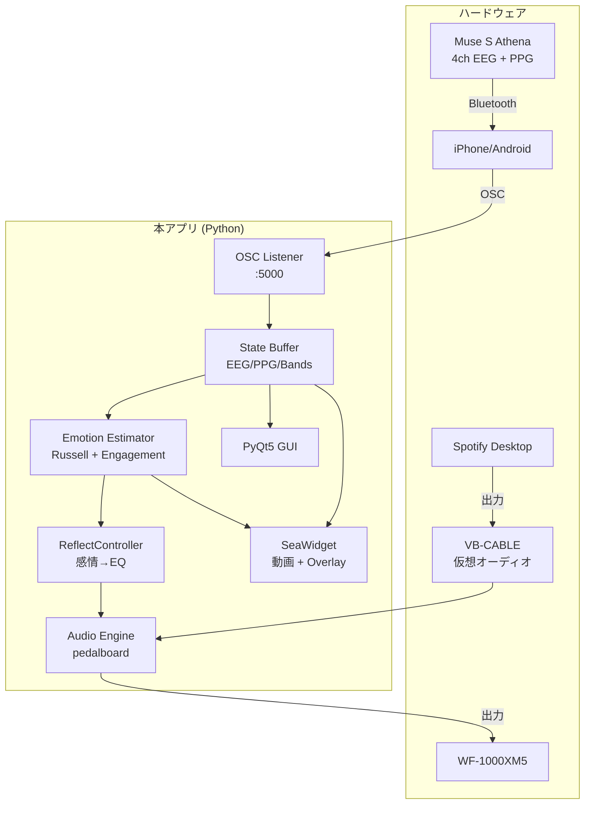

# アーキテクチャ

## システム全体図



## モジュール責務

### `realtime_monitor.py` (メイン)
- PyQt5 GUI のトップレベル
- OSC ディスパッチャ起動
- 30 fps のメイン更新ループ (`update_ui`)
- 各カードの構築 (EEG / Spectrogram / Band / Quality / HR / Emotion / EQ)
- 録画 (CSV) 機能

### `audio_engine.py`
- `AudioEngine`: VB-CABLE 入力 → pedalboard → 出力デバイス
- pedalboard chain: 6 filters (LowShelf, Peak×4, HighShelf) + Reverb
- デバイス自動検出 + 手動上書き
- スレッドセーフな gain 更新 (Lock)

### `eq_controllers.py`
- `ReflectController`: 感情 → 6-band 目標 dB マッピング
- EMA 平滑 (τ≈3s)
- audio へのプッシュをスロットル (10Hz + 0.05dB 変化しきい値)

### `eq_widgets.py`
- `InstrumentFader`: 縦フェーダ単体 (paintEvent カスタム)
- `InstrumentFaderBank`: 6 fader を横並びにする集合
- signal: `band_changed(str, float)`

### `sea_widget.py`
- `SeaWidget`: 動画背景 + オーバーレイ
- `_VideoSource`: cv2.VideoCapture のラッパ
- 3 シーン (calm / golden / storm) を hysteresis 切替
- overlay: カラーティント / HR リング / グリッター / 泡 / 霧

### `theme.py`
- `ThemeManager`: Accent × Background の 2 軸
- 変更通知の pub-sub

## データフロー

### 30 fps メインループ

```
state.lock 取得
  ├ EEG / PPG / band power / quality / HR をスナップショット
  └ release

EEG プロット更新
Spectrogram 更新 (1Hz throttle)
Band Power bar 更新
Quality dot 更新

感情計算
  ├ rus = compute_russell(bands, quality)
  ├ eng = compute_engagement(bands, quality)
  └ ar  = compute_arousal_only(bands, quality)

Russell view 更新

EQ Auto tick (Auto mode のみ)
  └ ReflectController.tick(rus, eng)
      ├ EMA 更新
      └ スロットル判定後 audio.set_bands()

Sea state 更新 (Sea ビュー表示時のみ)
  └ sea.set_state(arousal, valence, engagement, hr, hsi, fresh)

CSV 書き込み (録画中)
HR / Spectrogram の追加更新 (低頻度)

ヘッダ status / rate 更新
```

## スレッド構成

| スレッド | 役割 |
|---|---|
| Main (Qt) | GUI 描画、メイン更新ループ |
| OSC Server | pythonosc ディスパッチャ |
| Audio Stream | sounddevice コールバック (高優先度) |
| Video Source | cv2 フレーム読み込み (メインスレッドで動作) |

stateの読み書きは `threading.Lock` で保護。
audio の gain 更新も Lock + GIL で atomic。
